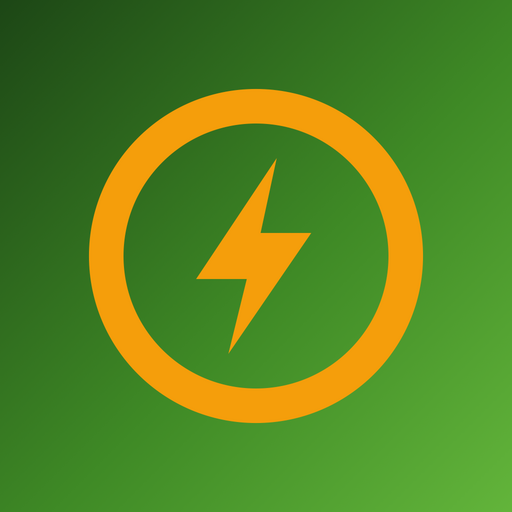

    
     
    <b>Stromkreis client for Android</b>

## Introduction

This is the native Android app for [Stromkreis](https://stromkreis.net), the open platform by energy communities
for energy communities. It connects members of an Austrian energy community (EEG) to their Stromkreis gateway at home
and, from anywhere, to the Stromkreis Cloud (`https://hac.stromkreis.net`).

The Stromkreis gateway runs on [openHAB](https://www.openhab.org); this app is a fork of the
[openHAB Android client](https://github.com/openhab/openhab-android) (EPL-2.0). Throughout the rest of this document
"openHAB server" refers to the openHAB instance on your Stromkreis gateway. The iOS counterpart lives at
[maigner/stromkreis-openhab-ios](https://github.com/maigner/stromkreis-openhab-ios).

The app is German-only (`de` is the default and only resource locale).

## Setup for members

There is no demo mode. Until the active server has a Stromkreis Cloud login the app shows the onboarding screen:
scan the one-time QR code from your Stromkreis page, paste the setup link, or simply open the
`https://stromkreis.net/app/setup/<token>` link on the phone. The setup can be repeated later via
*Settings → Stromkreis-Einrichtungscode scannen*. See [docs/stromkreis-onboarding.md](docs/stromkreis-onboarding.md)
for the accepted link formats and the server contract.

## Features

The app is deliberately minimal: it is a thin client for the openHAB Main UI of the Stromkreis
gateway, reached through the Stromkreis Cloud (an
[openHAB Cloud](https://github.com/openhab/openhab-cloud) instance).

* One-time setup via QR code or setup link (see above)
* Shows the gateway's Main UI (live view of PV system, battery and grid feed-in)
* Supports wall mounted tablets (fullscreen mode, keep-screen-on option)
* Crash reports as e-mail via ACRA (no tracking)

Everything else from the upstream openHAB app (sitemaps, notifications, NFC, Tasker, voice
commands, quick settings tiles, home screen widgets, day dream, device controls, maps, charts)
has been removed.

## Setting up development environment

The app is developed using Android Studio.

- Download and install [Android Studio](https://developer.android.com/studio)
- Check out the code from GitHub via Android Studio
- Install SDKs and Gradle if you get asked
- Click on "Build Variants" on the left side and change the build variant of the module "mobile" to "stableDebug".

Command line: `./gradlew :mobile:assembleStableDebug` and `./gradlew :mobile:testStableDebugUnitTest`
(JDK 17 and an Android SDK with platform 35 are required).

Before producing any amount of code please have a look at [contribution guidelines](CONTRIBUTING.md)

## No Google services

The app deliberately contains no Google services:

* no Firebase Cloud Messaging: the current data is fetched from the Stromkreis Cloud whenever the app is opened
* no Crashlytics: crash reports are offered as e-mail via ACRA

The only permissions are INTERNET, ACCESS_NETWORK_STATE and CAMERA (QR code scanner).

Application IDs: `net.stromkreis.app` (stable) and `net.stromkreis.app.beta` (beta). Both are fine for Google Play,
F-Droid or direct APK distribution.

## Trademark Disclaimer

openHAB is a trademark of the openHAB Foundation e.V.; Stromkreis is not affiliated with or endorsed by it.
Product names, logos, brands and other trademarks referred to within this repository are the property of their
respective trademark holders. Google Play and the Google Play logo are trademarks of Google Inc.
